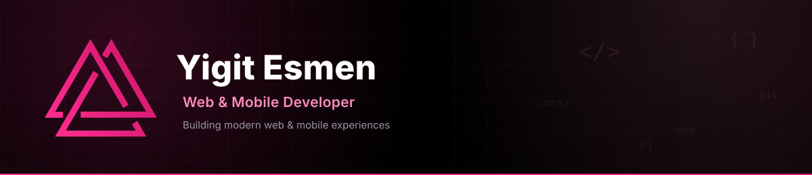
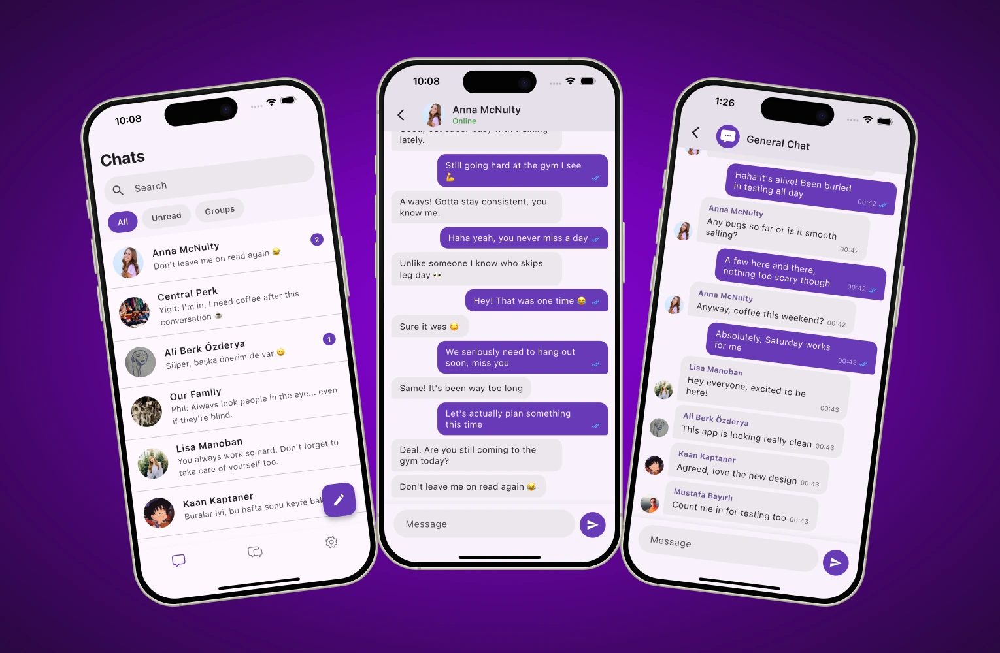
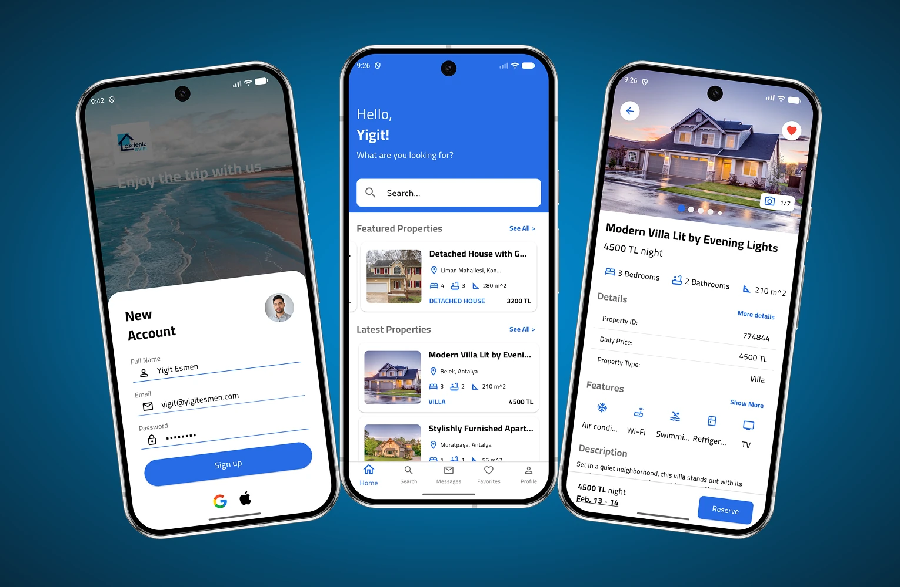
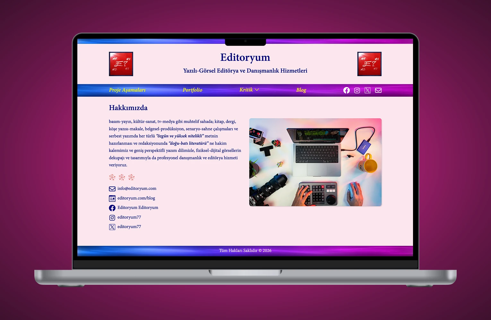
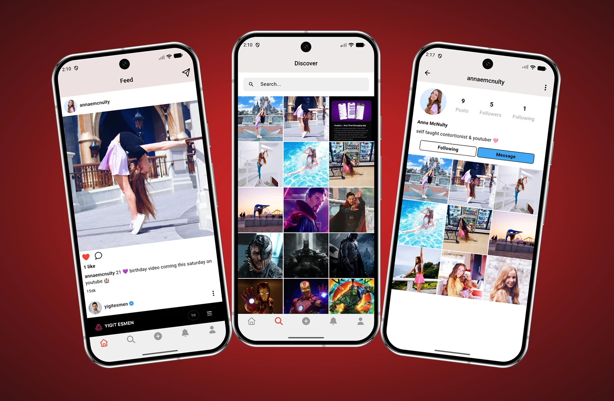
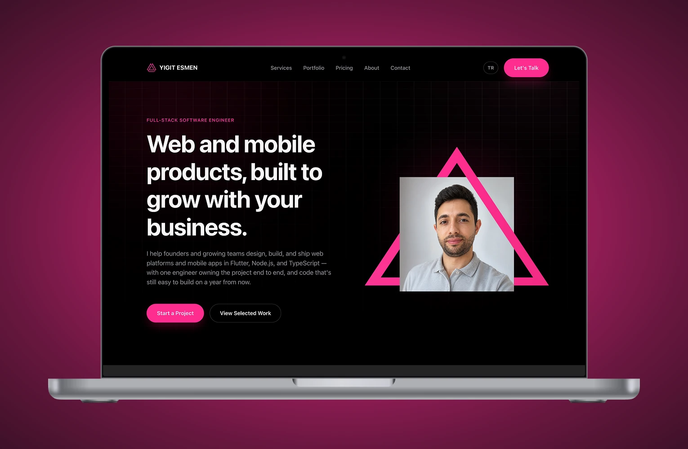

 

 

<table>
<tr>
<td width="70%" valign="top">

### About me

Full-Stack Web & Mobile Developer, owning projects from requirements analysis through production deployment. Engagements typically start from an unscoped requirement or problem statement, which I translate into a technical plan before implementation begins.

Engineering approach: statically typed languages, layered architecture, and automated testing/linting enforced from the first commit, prioritizing long-term maintainability over short-term velocity — codebases stay extensible as requirements change, without requiring a rewrite.

Primary stack: **Flutter** for mobile, **Node.js / Express / TypeScript** for backend services — single point of ownership across the database schema, API layer, and client implementation.

</td>
<td width="30%" valign="top" align="center">

 

  

<table>
<tr><td>🎓</td><td>Computer Science — <b>Dokuz Eylul University</b></td></tr>
<tr><td>🌍</td><td>Remote — <b>Worldwide</b></td></tr>
<tr><td>⏱️</td><td>Replies within <b>a day</b></td></tr>
</table>

</td>
</tr>
</table>

---

### 🛠️ What I do

<table>
<tr>
<td width="50%">

📱 **Flutter App Development**
Cross-platform iOS and Android apps from a single Dart codebase, with native modules where platform APIs require them.

🌐 **Web Development**
Responsive, performance-optimized websites and web applications, built on accessibility and SEO fundamentals.

⚙️ **Backend Development**
Server-side systems on Node.js and Express, designed for maintainability and horizontal scaling.

🔌 **REST API Development**
Documented, versioned REST APIs with authentication, input validation, and structured error handling.

</td>
<td width="50%">

🧩 **Full-Stack Development**
End-to-end ownership of the application layer — database schema, API design, and client implementation.

🎨 **UI Implementation**
Pixel-accurate implementation of design specs, including responsive breakpoints and interaction states.

⚡ **Performance Optimization**
Profiling and optimization of load times, render performance, and query efficiency.

🧭 **Technical Consulting**
Architecture review and technical roadmap planning for early-stage and scaling products.

</td>
</tr>
</table>

---

### 💻 Tech stack

<table>
<tr>
<td width="13%" nowrap><b>📱 Mobile</b></td>
<td>

</td>
</tr>
<tr>
<td valign="top" nowrap><b>🔧 Back&#8209;End</b></td>
<td>

</td>
</tr>
<tr>
<td valign="top" nowrap><b>📊 Database</b></td>
<td>

</td>
</tr>
<tr>
<td valign="top" nowrap><b>🎨 Front&#8209;End</b></td>
<td>

</td>
</tr>
<tr>
<td valign="top" nowrap><b>🧰 Tools</b></td>
<td>

</td>
</tr>
</table>

---

### 🌟 Featured projects

<table>
<tr>
<td colspan="2">

**[Dropline — Real-Time Messaging App](https://yigitesmen.com/projects/dropline)**
Instant delivery across one-on-one and group chats, with a validated, guided sign-up flow. In active development ahead of Google Play Store release.

      

[Code](https://github.com/yigitesmen/dropline-mobile) · [Details](https://yigitesmen.com/projects/dropline)

</td>
</tr>
<tr>
<td width="50%" valign="top">

**[Akdeniz Evim — Real Estate Mobile App](https://yigitesmen.com/projects/akdeniz-evim)**
Two-sided marketplace for daily-rental vacation homes, with map-based search, saved listings, and reviews for buyers, and listing management for owners via a secured REST API.

    

[Details](https://yigitesmen.com/projects/akdeniz-evim)

</td>
<td width="50%" valign="top">

**[Editoryum — Blog Website](https://yigitesmen.com/projects/editoryum)**
Publishing platform for literary writing and poetry, with a custom CMS admin panel that lets a non-technical team manage content independently, fully responsive across every device.

     

[Details](https://yigitesmen.com/projects/editoryum)

</td>
</tr>
<tr>
<td width="50%" valign="top">

**[Piqo — Photo Sharing App](https://yigitesmen.com/projects/piqo)**
Real-time feed for captioned posts, likes, and comments, using managed backend services to meet the client's timeline without a custom server.

    

[Code](https://github.com/yigitesmen/Piqo) · [Details](https://yigitesmen.com/projects/piqo)

</td>
<td width="50%" valign="top">

**[yigitesmen.com — Business Website](https://yigitesmen.com)**
Site covering services, portfolio, and pricing, presented through a custom, from-scratch design system.

   

[Live](https://yigitesmen.com)

</td>
</tr>
</table>

---

### Get in touch

Open to full-stack, Flutter, and Node.js/TypeScript engagements, as well as technical consulting on architecture and roadmap. Response time: within one business day.

  

